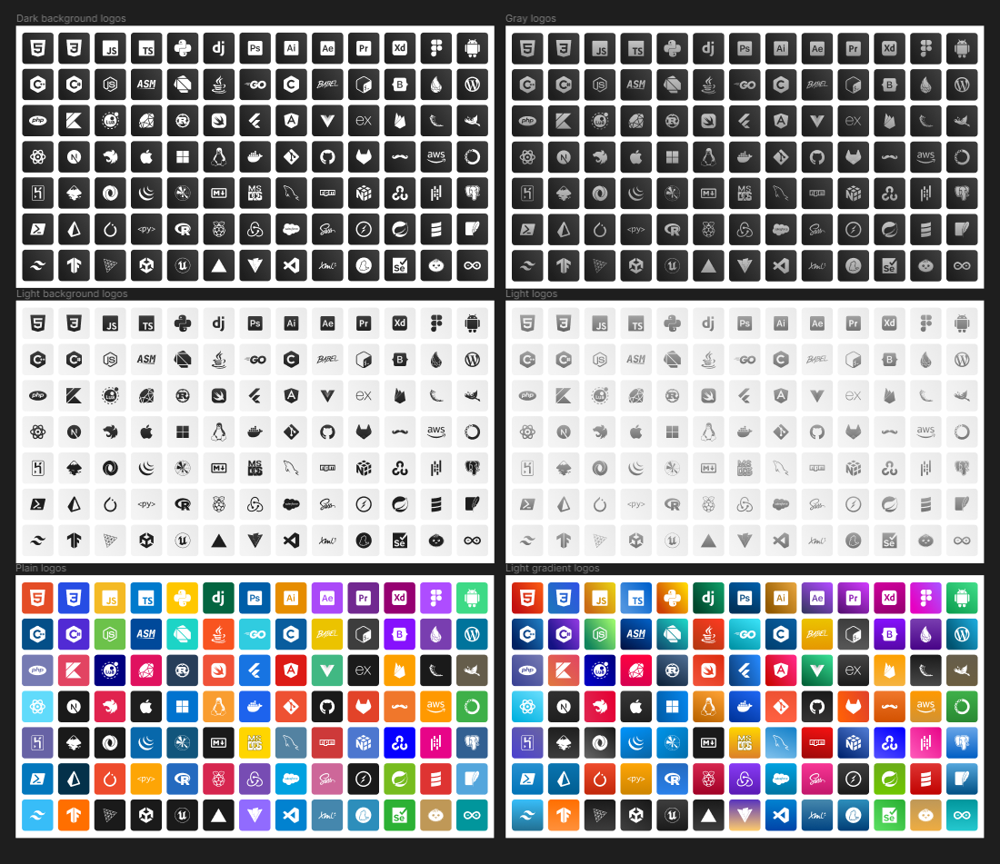

# Minicons

Welcome to Minicons! This repository is dedicated to providing a collection of SVG logos curated and enhanced for various uses, particularly for integration in personal projects. Currently, the repository includes logos in six different style types: "plain," "light-bg," "dark-bg," "gradient," "light-gray," and "dark-gray."

## Logos Status

Here's a rundown of the newest logos and their completion status:

| Logos               | Completed | Version |
|---------------------|-----------|---------|
| After Effects       | ✅        |         |
| Amazon Web Services |           |         |
| Anaconda            |           |         |
| Android             |           |         |
| Angular             | ✅        | v1.0    |
| Apple               | ✅        |         |
| Arduino             |           |         |
| Assembly            | ✅        | v1.0    |
| Babel               |           |         |
| Bash                |           |         |
| Bootstrap           |           |         |
| C                   | ✅        | v1.0    |
| Dart                | ✅        | v1.0    |
| Docker              | ✅        |         |
| Elixir              |           |         |
| Express             |           |         |
| Firebase            |           |         |
| Flask               |           |         |
| Flutter             | ✅        | v1.0    |
| Gimp                |           |         |
| Git                 |           |         |
| Github              |           |         |
| Gitlab              |           |         |
| Go                  | ✅        | v1.0    |
| Handlebars          |           |         |
| Heroku              |           |         |
| Inkscape            |           |         |
| Java                | ✅        | v1.0    |
| Json                |           |         |
| Jquery              |           |         |
| Kotlin              | ✅        | v1.0    |
| Linux               | ✅        |         |
| Lua                 | ✅        | v1.0    |
| Matplotlib          |           |         |
| Markdown            |           |         |
| MSDOS               |           |         |
| Mysql               |           |         |
| Next                | ✅        | v1.0    |
| Nest                | ✅        | v1.0    |
| NPM                 |           |         |
| Numpy               |           |         |
| OpenCV              |           |         |
| PHP                 | ✅        | v1.0    |
| Pandas              |           |         |
| Postgresql          |           |         |
| Powershell          |           |         |
| Premiere            | ✅        |         |
| Prisma              |           |         |
| Pyscript            |           |         |
| Pytorch             |           |         |
| R                   |           |         |
| Raspberry Pi        |           |         |
| React               | ✅        | v1.0    |
| Redux               |           |         |
| Ruby                | ✅        | v1.0    |
| Rust                | ✅        | v1.0    |
| Salesforce          |           |         |
| Scala               |           |         |
| Sass                |           |         |
| Socket.io           |           |         |
| Spring Boot         |           |         |
| Sqlite              |           |         |
| Swift               | ✅        | v1.0    |
| Tailwind            |           |         |
| TensorFlow          |           |         |
| Three.js            |           |         |
| Unity               |           |         |
| Unreal Engine       |           |         |
| Vercel              |           |         |
| Vite.js             |           |         |
| Visual Studio Code  |           |         |
| Vue                 | ✅        | v1.0    |
| Windows             | ✅        |         |
| XD                  |           |         |
| XML                 |           |         |
| Yarn                |           |         |
| Selenium            |           |         |
| Bun                 |           |         |

Stay tuned for more updates and additions as we continue to expand our collection of Minicons.
